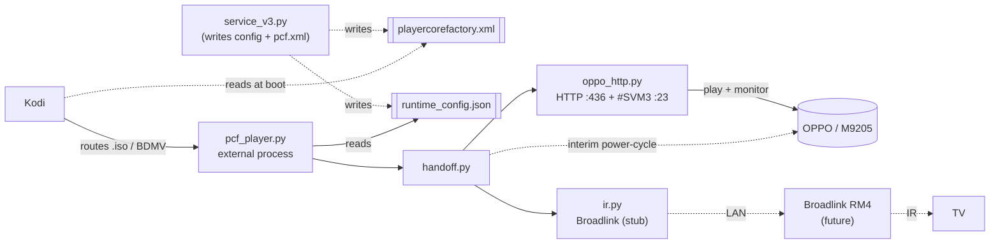

# OppoKodiBridge v3 — architecture & walkthrough

**playercorefactory fork:** Kodi hands a disc to the OPPO *before* playing it (so there's no pre-play
blip), monitors playback via the OPPO's verbose `#SVM 3` push stream, and switches the TV CEC-free.

---

## The 30-second version

Instead of letting Kodi start a disc and then yanking it back (v2's blip), v3 tells Kodi — via
`playercorefactory.xml` — to hand `.iso`/BDMV files to an **external player script** *before* Kodi's
own player touches them. That script runs outside Kodi, plays the file on the OPPO over the network,
watches for the stop via the OPPO's push-based verbose mode, and exits. No blip, no CEC.

---

## Play flow — click to switch-back

```mermaid
sequenceDiagram
    autonumber
    actor U as You
    participant K as Kodi
    participant P as playercorefactory.xml
    participant X as pcf_player.py (external)
    participant O as OPPO / M9205
    participant T as TCL TV

    Note over K,P: At boot, Kodi loads playercorefactory.xml<br/>(the v3 service wrote it; it persists on disk)

    U->>K: Play an .iso / BDMV folder
    K->>P: which player for this file?
    P-->>K: external player "OppoKodiBridge"
    Note over K: Kodi never starts the file → NO pre-play blip
    K->>X: launch  python3 pcf_player.py "nfs://…file"

    X->>X: read runtime_config.json (settings)
    X->>T: switch to OPPO (Broadlink IR, else power-cycle)
    X->>O: HTTP: wake → signin → mount NFS → play

    rect rgb(232,244,255)
    Note over X,O: Phase 1 — pre-playback (HTTP, latency-tolerant)
    loop until playing
        X->>O: HTTP /getglobalinfo
        O-->>X: is_video_playing?
    end
    end

    rect rgb(232,255,236)
    Note over X,O: Phase 2 — verbose #SVM 3 (push, instant)
    X->>O: #SVM 3  (TCP :23)
    loop during playback
        O-->>X: @UTC  (~1s heartbeat)
    end
    O-->>X: @UPL STOP  (pushed the instant it stops)
    end

    X->>O: #SVM 0 + close
    X->>T: switch back to Kodi (IR, or Kodi re-asserts)
    X-->>K: process exits
    K->>U: back to Kodi
```

### Step by step

**Boot / service startup**
1. Kodi starts and, as part of startup, **loads `playercorefactory.xml`** from userdata. This file was
   written by the v3 service on a *previous* run and **persists on disk** — which is why a fresh
   install needs one restart (the file has to already be there when Kodi boots).
2. The **v3 service** (`service_v3.py`) starts, does two things, and then idles:
   - reads the add-on settings (the one place with Kodi APIs) and **dumps them to
     `runtime_config.json`** in the add-on's data dir;
   - **(re)writes `playercorefactory.xml`** pointing Kodi at `pcf_player.py`.
   - (It re-does both on `onSettingsChanged`, and removes the file only if you turn the handoff off.)

**You press play on an ISO/BDMV**
3. Kodi consults playercorefactory. The **rules match** `.iso` / `*/BDMV/*` / `*/VIDEO_TS/*` and route
   to the external "OppoKodiBridge" player **instead of Kodi's internal player** — so Kodi never starts
   decoding and there's **no blip**. (That match *is* the disc filter; v2's runtime `disc_iso_only`
   check is gone.)
4. Kodi launches `/usr/bin/python3 pcf_player.py "<the nfs:// file path>"` as a **separate process**
   and waits for it to exit.

**The external player hands off (pure network, no Kodi APIs)**
5. `pcf_player.py` reads `runtime_config.json` (locating it from its own path) → builds a `Config` →
   calls `handoff.play_on_oppo(config, file)`.
6. `handoff.play_on_oppo`:
   - **maps the path** — strips the Kodi prefix → in-share relative → mount-folder + play-name
     (collapsing to the disc folder for BDMV);
   - **switches the TV to the OPPO** — Broadlink IR if configured (CEC-free), else the interim OPPO
     power-cycle;
   - **plays on the OPPO over HTTP** — wake (`:7624`) → init dance (firmware/setup/signin/globalinfo) →
     resolve the OPPO's own NFS server (`/getdevicelist`) → `loginNfsServer` → `mountNfsSharedFolder`
     → `/playnormalfile` (files/ISO) or `/checkfolderhasBDMV` (discs).

**Monitoring — two phases**
7. **Phase 1 — pre-playback (HTTP):** poll `/getglobalinfo` until the OPPO *actually* starts playing
   (NFS mount + buffer can take ~10s). Latency-tolerant, so HTTP owns this window.
8. **Phase 2 — playing (verbose TCP):** open a `#SVM 3` connection on `:23`. The OPPO **pushes** `@UTC`
   (~1s heartbeat) and `@UPL` on every state change. Block until `@UPL STOP`/`HOME` — detected
   **instantly**, not on a poll tick. (If the stream goes quiet for ~6s it cross-checks HTTP.)

**Stop / switch-back**
9. On `@UPL STOP`: send `#SVM 0`, close the connection → **switch the TV back to Kodi** (Broadlink IR,
   or — for now — rely on Kodi re-asserting the active source when the external player exits) →
   `play_on_oppo` returns → `pcf_player` **exits**.
10. Kodi sees the external player exit and resumes the foreground.

---

## Component map



| File | Role |
|------|------|
| `service.py` → `service_v3.py` | The service. Writes `playercorefactory.xml` + `runtime_config.json` on start; idles; refreshes on settings change. **Does not** intercept playback. |
| `resources/lib/pcf.py` | Builds + installs/uninstalls the `playercorefactory.xml` (rules + the external-player command). |
| `pcf_player.py` | **The external player** Kodi launches. Runs outside Kodi, loads config, calls the handoff. |
| `resources/lib/handoff.py` | Headless handoff: path map → switch → OPPO HTTP play → two-phase monitor → switch back. No xbmc/CEC. |
| `resources/lib/oppo_http.py` | OPPO protocol client (HTTP `:436` + control `:23`), incl. `verbose_watch_until_stop` + the `@UPL` parser. |
| `resources/lib/ir.py` | Broadlink IR backend (stub until the RM4). `configured()` false → falls back to power-cycle. |
| `resources/lib/config.py` | `Config`; `from_addon()` (service, in Kodi) and `from_dict()` (external player, via the JSON). |

---

## Non-obvious design decisions

- **`runtime_config.json` is the bridge.** The external player can't call `xbmcaddon`, so the service
  (which can) dumps the resolved settings to JSON for it to read.
- **The playercorefactory.xml must persist.** Kodi reads it only at **startup**, before any add-on
  runs — so the service can't "set it up just in time." It writes it and leaves it; fresh installs
  need one Kodi restart.
- **CEC-free by design.** Because the player is a separate process, there's no `CECActivateSource`.
  Switching is IR (or the interim power-cycle) — which is why v3 pairs naturally with the Broadlink.
- **Verbose is per-play and scoped to playback** — opened only once playback starts, torn down
  (`#SVM 0` + close) on stop.

---

## v2 vs v3

- **v2:** service monitor — Kodi starts the file, the add-on stops it and hands off (brief blip); HTTP
  poll for stop; CEC power-cycle + `CECActivateSource` reclaim.
- **v3:** playercorefactory — Kodi hands the file off before playing it (no blip); verbose `#SVM 3` for
  instant stop; CEC-free (Broadlink IR / interim power-cycle).

> These diagrams render inline on GitHub. A standalone HTML version (mermaid.js CDN) can also be
> generated under `build/` (git-ignored).
