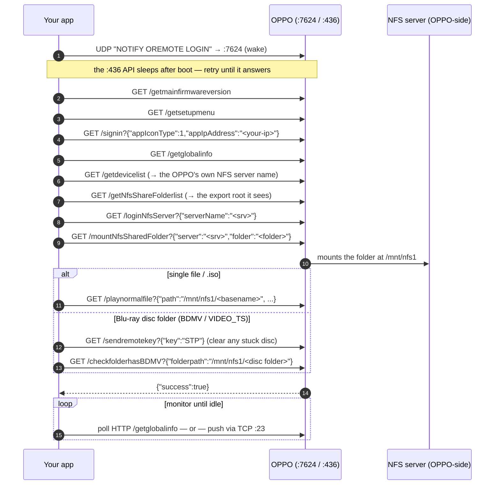

# Playing files on an OPPO / M9205 over the network — developer guide

A protocol-level guide for developers integrating with an **OPPO UDP-203/205** (or an **M9205**-style
clone) to **play a specific file from a network share**. This guide is **only about playback**. HDMI /
TV-input switching is a separate concern (see the CEC guide).

Everything here is verified live against an **M9205 clone** (the OppoKodiBridge reference
implementation, `service.oppokodibridge/resources/lib/oppo_http.py`). The OPPO HTTP "app API" is
**community-reverse-engineered, not official** — see [References](#references).

---

## TL;DR — the one fact that determines your whole design

> **To play a specific network file by path, you must use the OPPO's HTTP "app API" on TCP `:436`.
> The documented RS-232 / IP-control protocol (serial cable or net control on TCP `:23`) cannot do it.**

The `#XXX` control protocol is a *remote control*: power, transport (play/pause/stop), cursor
navigation, and status queries. **No command takes a file path or URL** — there is no "load this
file", "open this URL", or "play /path/to/movie.iso". The only way to start a specific file you can
**not** do with it. So:

| Control plane | Transport | Documented? | Can it **play a file by path**? | Can it **control / monitor**? |
|---|---|---|---|---|
| **HTTP app API** | TCP `:436` | No (reverse-engineered) | **✅ Yes** — the only way | ✅ yes (`/getglobalinfo`, `/sendremotekey`) |
| **IP / serial control** | TCP `:23` / RS-232 | ✅ Yes (official) | **❌ No — hard limitation** | ✅ power/transport/nav + verbose status push |

**Why the limitation exists:** the RS-232/IP protocol was designed to *replace the remote*, not to
load media. You could in theory simulate button presses (`#NUP`/`#NDN`/`#SEL`) to walk the on-screen
file browser, but that is blind, non-deterministic (depends on the exact menu state and list order),
and not a real play-by-path. Treat it as **not possible**.

---

## The playback flow (HTTP app API)

---

## The approach that works (step by step)

All HTTP calls are **GET** to `http://<oppo-ip>:436/...`. Query encoding is **inconsistent between
endpoints** — some take the whole `{...}` JSON percent-encoded after `?`, others take literal braces
with only the path value encoded. The exact byte-level encoding is in `oppo_http.py`.

1. **Wake.** The `:436` API sleeps after boot. Send the UDP datagram `NOTIFY OREMOTE LOGIN` to **port
   7624**, then poll until `:436` answers. (It is *not* an HTTP call and *not* a broadcast.)
2. **Init handshake — required**, or sign-in/mount fail on a fresh session:
   `/getmainfirmwareversion` → `/getsetupmenu` → `/signin?{"appIconType":1,"appIpAddress":"<you>"}` →
   `/getglobalinfo`.
3. **Resolve the NFS server the OPPO can reach** (it may differ from the address your PC uses):
   `/getdevicelist` → the entry with `"sub_type":"nfs"` is the server; `/getNfsShareFolderlist` → the
   export root.
4. **Log in + mount the file's FOLDER** (not the file, and never a non-exported path — see
   [pitfalls](#combinations-we-tried-that-fail--dont-repeat-these)):
   `/loginNfsServer?{"serverName":"<srv>"}` → `/mountNfsSharedFolder?{"server":"<srv>","folder":"<folder>"}`.
   It mounts at **`/mnt/nfs1`**.
5. **Play:**
   - **Single file / `.iso`:** `/playnormalfile?{"path":"/mnt/nfs1/<basename>","index":0,"type":1,"appDeviceType":2,"extraNetPath":"<srv>","playMode":0}` — play the **bare basename**, the OPPO won't play a sub-path of a mount.
   - **Blu-ray disc folder (BDMV):** mount the disc folder's **parent**, send `/sendremotekey?{"key":"STP"}`, then `/checkfolderhasBDMV?{"folderpath":"/mnt/nfs1/<disc folder>"}` — on this OPPO that call **starts the disc** (it does not merely check). `VIDEO_TS` (DVD) works the same way.

A success reply looks like `{"success":true,"msg":""}`.

---

## HTTP commands that work (`:436` endpoint reference)

| Endpoint | Purpose |
|---|---|
| `NOTIFY OREMOTE LOGIN` (UDP `:7624`) | Wake the `:436` API |
| `/getmainfirmwareversion`, `/getsetupmenu` | Init handshake |
| `/signin?{"appIconType":1,"appIpAddress":"<ip>"}` | Register the controlling app (required) |
| `/getglobalinfo` | Player + **playback state** (booleans, below) |
| `/getdevicelist` | Devices incl. the OPPO's own NFS server (`sub_type:"nfs"`) |
| `/getNfsShareFolderlist` | Export roots the OPPO sees |
| `/loginNfsServer?{"serverName":"<srv>"}` | Log into the NFS server |
| `/mountNfsSharedFolder?{"server":"<srv>","folder":"<folder>"}` | Mount the folder → `/mnt/nfs1` |
| `/playnormalfile?{...}` | **Play a file / ISO** by `/mnt/nfs1/<basename>` |
| `/checkfolderhasBDMV?{"folderpath":"/mnt/nfs1/<disc>"}` | **Start a BDMV disc folder** |
| `/sendremotekey?{"key":"STP"}` | Stop (also: any remote key, e.g. `POW`, `MUT`) |

(`/sendremotekey` is the only one of these the wider community has published — see References; the NFS
mount/play chain came from the `emby-chinoppo-bridge` reverse engineering.)

---

## TCP / serial commands that work (`:23` / RS-232 control reference)

Documented protocol. Settings: **9600 8N1, no flow control**. Each command is `#` + a 3-letter code +
optional space-separated params + CR (`\r`). Useful ones for an integration:

| Command | Purpose |
|---|---|
| `#PON` / `#POF` | Power on / standby |
| `#QPW` | Query power → `@OK ON` / `@OK OFF` |
| `#PLA` / `#PAU` / `#STP` | Play / pause / stop **(of whatever is already loaded)** |
| `#NUP` `#NDN` `#NLT` `#NRT` `#SEL` `#HOM` | Cursor nav / home (drive menus) |
| `#SVM 0..3` | **Set verbose mode** (status push — see monitoring) |
| `#QPL` / `#QVR` | Query playback status / verbose response |

> **None of these load a file.** `#PLA` plays *what is already selected*; there is no path parameter
> anywhere in the protocol. This is the limitation from the [TL;DR](#tldr--the-one-fact-that-determines-your-whole-design).

---

## Live monitoring strategies

You have two ways to know what the player is doing. **Monitoring is the one area where the documented
TCP protocol *can* help** (verbose mode), even though playback can't.

### A) HTTP polling — `/getglobalinfo`
Poll `http://<ip>:436/getglobalinfo` on an interval. It returns booleans:
`is_video_playing` / `is_audio_playing` / `is_bdmv_playing` / `is_disc_playing` (plus `cur_media_type`,
`activeapp`). Simple and reliable, but you only learn about a stop on the next poll (≈ your interval),
and an NFS mount + buffer can take ~10 s before the first "playing" read.
- **Use it for:** the pre-playback / "has it started yet" window, where latency doesn't matter.

### B) TCP verbose push — `#SVM 3` on `:23` (documented, **instant**)
Open a TCP connection to `:23`, send `#SVM 3`. The OPPO replies `@SVM OK 3` and then **pushes**
unsolicited status:
- **`@UPL <status>`** — pushed **the instant** playback state changes: `@UPL PLAY`, `@UPL STOP`,
  `@UPL HOME`, `@UPL PAUS`, …
- **`@UTC <trk> <chap> C hh:mm:ss`** — a time-code heartbeat ~**every second** during playback.

Detect end on `@UPL STOP` / `@UPL HOME` — no poll lag. Send `#SVM 0` and close when done.
- **Use it for:** instant stop detection during playback. (Confirmed working on the M9205 clone.)

### Recommended hybrid (what OppoKodiBridge uses)
Two-phase: **HTTP-poll `/getglobalinfo` until playback starts**, then **open `#SVM 3` and read until
`@UPL STOP`** for an instant stop, with an HTTP re-check as a fallback if the verbose stream goes
quiet. Caveat: verbose and the power commands share `:23`, so a `#POF` drops the verbose connection —
open verbose *after* the player is up. Verbose is silent while the player is idle (it only pushes once
playback begins).

---

## Combinations we tried that FAIL — don't repeat these

| What we tried | Result | Do this instead |
|---|---|---|
| **Play a file via the TCP/serial control protocol** | Impossible — no path command exists | Use the HTTP `:436` API |
| Older "ported" HTTP guesses: `/login_nfs`, `/signin?{"user","password"}`, `payload=` body | Wrong endpoints — never works | `/loginNfsServer`, `/signin?{"appIconType":1,"appIpAddress":...}`, query-string JSON |
| Wake with a `0x55` "activate" packet, or a broadcast | API never wakes | UDP `NOTIFY OREMOTE LOGIN` → **:7624** (unicast) |
| **Mount a folder the NAS does not export** (e.g. the path *your PC* uses, against the OPPO's own server) | **HARD-CRASHES the OPPO** — both `:436` and `:23` die; needs a mains power-cycle | Only mount a real export (from `/getNfsShareFolderlist`) or a subfolder of it |
| Mount the file and play it, or play a **sub-path** of a mount | Won't play | Mount the **folder**, play the **bare basename** |
| Play a Blu-ray by pointing at `index.bdmv` | Won't play | `/checkfolderhasBDMV` on the **disc folder** (after a `STP`) |
| Load a new disc while `bd_is_playing` is stuck | Mount/parse hangs | Send `/sendremotekey?{"key":"STP"}` first |
| Use *your PC's* NAS address as the NFS server | Mount fails (dual-homed NAS) | Use the OPPO's own server from `/getdevicelist` |

---

## References

- **OPPO UDP-20X RS-232 & IP Control Protocol** (official) — the documented `#XXX` command set,
  verbose mode (`#SVM` / `@UPL` / `@UTC`), serial settings:
  <http://download.oppodigital.com/UDP203/OPPO_UDP-20X_RS-232_and_IP_Control_Protocol.pdf>
- **OPPO UDP-20x MediaControl app** — the source of the `:436` HTTP API; its `HttpClientRequest.java`
  enumerates the requests. ([Apple App Store](https://apps.apple.com/gb/app/oppo-udp-20x-mediacontrol/id1194885761),
  [Amazon Appstore](https://www.amazon.com/OPPO-Digital-Inc-UDP-20x-MediaControl/dp/B06Y2NJ29P))
- **openHAB community — "OPPO UDP-203 IP control / HTTP binding"** — community reverse-engineering of
  the `:436` API (`sendremotekey`, GET + URL-encoded JSON, `{"success":true}`):
  <https://community.openhab.org/t/oppo-udp-203-ip-control-http-binding/40374>
- **`emby-chinoppo-bridge`** — the project the NFS login/mount/`playnormalfile`/`checkfolderhasBDMV`
  sequence was reverse-engineered from (our primary reference for the playback chain).
- **OppoKodiBridge `oppo_http.py`** — the working reference implementation of everything above
  (this repo).

> The HTTP app API is reverse-engineered and undocumented by OPPO; behaviour varies on clones. Verified
> here on an M9205 clone.
