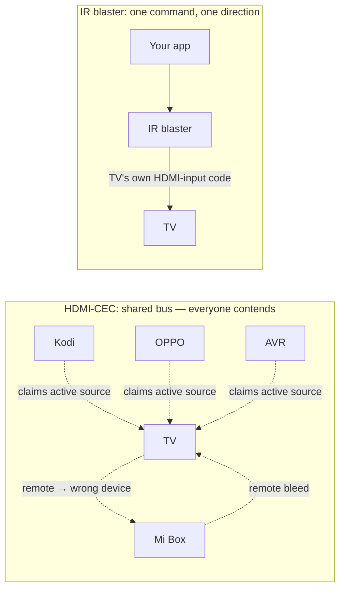

# Switching the TV's HDMI input to your source — a developer guide

Companion to the [network-playback guide](OPPO_PLAYBACK_PROTOCOL.md). Once a source (an OPPO, a Kodi
box, anything) is playing, you usually also want the **TV to switch to that source's HDMI input** — and
back. There are three ways to do it, and two of them are far more painful than they look.

> **Recommendation up front:** for an automated, reliable setup, use an **external network IR blaster**
> (e.g. a Broadlink RM4 mini). It sidesteps both the per-brand network mess *and* the HDMI-CEC tangle
> below. Reach for CEC or network control only if you can't add an IR blaster.

| Approach | How | Pros | Cons |
|---|---|---|---|
| **TV network control** | the TV's own LAN API (per brand) | precise, addressable | **proprietary per brand**, often needs a **developer/debug mode**, inconsistent, a backend per brand |
| **HDMI-CEC** | the shared CEC bus (One Touch Play / active source) | universal, no per-brand code | **ownership contention, no clean "give it back", cross-device remote bleed**, slow without QMS |
| **IR blaster** | send the TV's own input IR codes | off the CEC bus, instant, you control exactly when/what | needs line-of-sight + the TV's IR codes; one more device |

---

## 1. TV network control (per-brand) — proprietary and inconsistent

Most smart TVs expose *some* LAN control, but **every brand does it differently**, and many **don't
expose it at all until you enable a developer/debug mode**. The headline trap: **Chinese domestic
models of TCL and Hisense need a completely different path to enable ADB** than their international
(Google TV) counterparts — see the callout below.

### Per-brand requirements

| Brand / OS | Control protocol | How to enable / authenticate | Discrete "HDMI N"? |
|---|---|---|---|
| **LG (webOS)** | WebSocket — `ws://…:3000`, secure `wss://…:3001` on newer firmware | first connect raises an **on-screen pairing** prompt → client key; some features need **Developer Mode** (install the Dev Mode app, sign in with an LG developer account, toggle it on) | **yes** (`ssap://tv/switchInput`) |
| **Samsung (Tizen)** | local WebSocket — `:8001` (plain, info + keys), `:8002` (secure, token); or the **SmartThings cloud** API | `:8002` needs an on-screen **"Allow"** + a **token** you store; SmartThings needs a token with *Devices* permission. Strict simultaneous-connection limits | partial (key codes; input/state via SmartThings) |
| **Sony (Bravia)** | **REST (Scalar) API + IRCC-IP** | a **Pre-Shared Key** (`X-Auth-PSK` header), set in **Settings → Network → Home network → IP Control → Authentication → Normal + Pre-Shared Key**; newer Bravia are Google TV so **ADB** also works | **yes** (`setPlayContent` with `extInput:hdmi?port=N`) |
| **Google TV / Android TV** (Sony, Philips, **TCL-intl**, **Hisense-Android**, **Xiaomi-intl**…) | **ADB over TCP `:5555`** (+ the Android TV Remote v2 pairing protocol for keys) | **Settings → System → About → Build number ×7** → Developer options → enable **(Wireless) ADB debugging** → `adb connect <ip>:5555`; first connect raises an on-screen **RSA "Allow USB debugging?"** prompt | **no** discrete switch — you send key-events / `am start` intents and navigate |
| **Roku** (some US TCL / Hisense) | **ECP** — `http://tv:8060/…` | on by default (no auth) — the easy one, but Roku-only | **yes** (`launch`/`tv` input HDMI) |
| **Hisense (VIDAA)** | **MQTT on `:36669`** (the RemoteNOW app's broker, mosquitto) | creds `hisenseservice` / `multimqttservice`; **pair via an auth code shown on the TV**; some sets require a **client certificate** | via source/key commands |
| **Xiaomi (Mi TV, intl)** | Android TV / Google TV → **ADB** | dev mode by tapping the **model name ×7**, then the ADB toggle lives under **Settings → Account & Security → ADB debug → Allow** (note: *not* under Developer options) | no discrete switch |

### Gotchas that bite
- **Android 13+:** *Wireless* debugging was split from *USB* debugging — enable the right one for a
  networked TV.
- **Android 14:** ADB security **randomises the port after sleep/reboot**, so `:5555` is no longer fixed
  — you need an auto-re-enable helper.
- **Many TVs have no discrete "switch to HDMI 3"** — only an Input/Source toggle or picker, so you end
  up sending blind navigation.
- **Dev/debug modes reset** after firmware updates, factory resets, or time-outs — silently breaking
  your integration.
- **You maintain a backend per brand** — different transport, auth, and command set. (This project's v1
  literally shipped Sony-PSK / LG / Samsung / SmartThings / ADB-keyevent / Roku-ECP / custom backends.)

### ⚠️ Chinese domestic models (TCL / Hisense / Xiaomi) — a *different* path to ADB

This is the part that catches people out. On an **international** Google TV / Android TV set you just
tap *Build number ×7* and flip on ADB. **Chinese domestic models deliberately hide or remove that** —
manufacturers disable developer mode to block rooting / bootloader unlock, and the Chinese firmware
often ships a **stripped settings menu** (only Wi-Fi / storage / permissions; *no* developer options).
To get ADB you go through a **hidden service / factory menu**:

- **Generic (CVTE-board sets):** key combo `MENU → 1 → 1 → 4 → 7` on the remote → **Debug → Enable ADB →
  ON** (and it's **Wireless** debugging, not USB).
- **Hisense (VIDAA China):** **Settings → Sound → Volume Balance**, then quickly press the sequence
  **Menu → Confirm → Options → Confirm**; switch the **`u` mode to `m` mode** to unlock the debug
  options, then enable ADB.
- **TCL / FFALCON (雷鸟, TCL's China sub-brand):** Android-based but locked down — developer options are
  often not exposed through normal settings; you need the model's **service menu**, and some require a
  **package-verification** tweak before ADB installs work.
- **Xiaomi (PatchWall / MIUI for TV):** dev mode via *model name ×7*, ADB under **Account & Security**
  (as above); China firmware drops Google services and re-lays the menus.

Net: a China-domestic set can need a **remote key-combo into an engineering menu plus a mode switch**
just to expose ADB — while the *international model of the very same TV* enables it with a trivial
*Build-number ×7*. That inconsistency (same brand, same panel, different firmware, different unlock) is
exactly why a generic "just hit the TV's network API" strategy is fragile. **It's also a strong reason
to prefer an IR blaster, which doesn't care what firmware the TV runs.**

---

## 2. HDMI-CEC — universal, but a tangle

CEC is the appealing option because **everything has it**: the Kodi box, the OPPO, AVRs, and the TV all
speak CEC (branded *Bravia Sync* / *Anynet+* / *SimpLink* / *T-Link* / *VIERA Link* …). One bus, no
per-brand code. In practice it's a mess for automated control:

### a) Ownership contention — and there is no "give it back"
CEC's **One Touch Play**: a device declares itself the **active source** when it starts playing, and the
TV switches to it. The problem is there is **no clean "return ownership" primitive** — **every device
wants to *be* the one you see and imposes itself.** When your source stops, *something* has to actively
re-claim the TV (e.g. Kodi's `CECActivateSource`), and devices end up **fighting** over who's active.

### b) A stateful control chain
Driving switching through CEC means **monitoring play / stop / start events** across devices and
**asserting or reclaiming active source at exactly the right moments** — a fragile little state machine
that has to track "who should own the screen now," with no authoritative arbiter.

### c) Cross-device remote bleed (this bites hard)
CEC remote pass-through and active-source frames can land on the **wrong devices**. In our own testing,
CEC ended up effectively **controlling *every* device on the TV at once** — the Kodi box, the OPPO, the
TV, *and* an unrelated streaming box (a Mi Box) on another input were all being driven. Injecting an
`<Active Source>` frame with a **spoofed logical address** corrupted address allocation and remote
routing for the **whole bus**, not just the two devices we cared about. (See the playback project's CEC
notes.) The only *safe* CEC switch we found is a device announcing **its own** source (e.g. the OPPO on
power-on); spoofing it from elsewhere breaks the bus.

### d) Speed: it's slow without QMS (yet another requirement)
A CEC input switch is often **slow** because the whole HDMI chain has to **re-sync** — the multi-second
black-screen "bonk" — especially when the new source's **frame rate** differs (e.g. a 60 Hz UI → a
24 Hz movie). **Quick Media Switching (QMS)** (HDMI 2.1) removes that blackout by adjusting the
display's rate on the fly — *but* it needs **QMS support end-to-end** (source **and** any AVR **and** the
TV) and only works when resolution/HDR match. Most real chains don't have full QMS, so the switch stays
slow. So "make CEC switching fast" becomes "re-buy your whole chain for QMS."

### e) Inconsistent implementations
Each brand's CEC stack behaves a little differently (and many users disable it because of exactly the
bleed/contention issues above), so you can't rely on uniform behaviour.

**Bottom line:** CEC looks like the universal answer and turns into a stateful, contended, leaky
control plane with no clean hand-back and poor speed unless your entire chain is QMS-capable.

---

## 3. IR blaster — the pragmatic winner

A **network-controlled IR blaster** (e.g. a **Broadlink RM4 mini**) just sends the **TV's own IR codes**
for input selection — exactly what its remote does.

**Why it wins:**
- **Completely off the CEC bus** — no ownership fight, no cross-device bleed, nothing to corrupt.
- **You control exactly when and what** — send "HDMI 1" on play, "HDMI 4" on stop. Deterministic.
- **Brand-agnostic at the protocol level** — you don't write a per-brand backend; you just need the
  TV's IR codes (the blaster speaks IR to any TV).
- **Instant**, and decoupled from the source's power/CEC behaviour.

**Trade-offs:**
- Needs **line-of-sight** (or a stick-on emitter) to the TV's IR receiver.
- You need the TV's **input IR codes** — ideally **discrete** codes (`HDMI 1`, `HDMI 2`, … — many TVs
  have them even if the remote button doesn't), learned via the blaster or from an IR-code database;
  otherwise an `Input → arrow → OK` **macro**, which is a touch more fragile.
- One more small device on the network.

For a single known TV it removes essentially all the complexity above. That's why it's the
recommendation.

---

## Our hard-won learnings (the Kodi / OPPO / TCL chain)

Concrete results from building this on a Ugoos (CoreELEC/Kodi) + M9205 (OPPO clone) + TCL Q9L Pro:

- **The OPPO asserts CEC active source only on power-ON** (not when it starts playing while already on),
  so we **power-cycled it** to switch the TV — works, but ~24 s (mostly its boot time).
- **Two attempts to inject the switch from the Kodi box both broke the bus:** `cec-client` (opened a
  second libCEC client and corrupted Kodi's own CEC), and writing the frame to the Amlogic
  `/sys/class/aocec/cmd` driver (the spoofed active-source frame **cross-controlled the Mi Box** on
  another input). Reverted both.
- **No clean reclaim:** Kodi's `CECActivateSource` is best-effort; the input would still get re-grabbed.
- **Recovery from a confused CEC bus:** put the asserting device in standby + restart Kodi; if a sibling
  device is *still* cross-controlled, **cold-start everything with the TV unplugged from mains for
  ~30–60 s** (CEC state survives standby — only a real power-off flushes the TV's routing table).
- **Direction:** move to an **external IR blaster (Broadlink RM4 mini)** for a CEC-free switch — exactly
  the recommendation above.

---

## References

- **HDMI QMS (Quick Media Switching):**
  [hdmi.org](https://www.hdmi.org/spec2sub/quickmediaswitching) ·
  [What Hi-Fi? explainer](https://www.whathifi.com/advice/what-is-quick-media-switching-qms-the-latest-hdmi-21-feature-explained) ·
  [FlatpanelsHD guide + support list](https://www.flatpanelshd.com/guide.php?subaction=showfull&id=1679669681)
- **Per-brand TV network control:**
  - **LG webOS** — [developer docs](https://webostv.developer.lge.com/develop/references/webostvjs-webos) (Developer Mode + WebSocket)
  - **Samsung Tizen** — [ha-samsungtv-smart](https://github.com/ollo69/ha-samsungtv-smart) (`:8001`/`:8002` token), [openHAB Samsung TV binding](https://www.openhab.org/addons/bindings/samsungtv/)
  - **Sony Bravia** — [official IP-control: REST API + Pre-Shared Key](https://pro-bravia.sony.net/develop/integrate/ip-control/index.html)
  - **Hisense VIDAA** — [mqtt-hisensetv (port 36669)](https://github.com/Krazy998/mqtt-hisensetv), [hisensetv API docs](https://hisensetv.readthedocs.io/en/latest/api.html)
  - **Android TV / Google TV ADB** — [ADB on Google TV guide](https://allaboutchromecast.com/using-adb-on-google-tv-streamer/), [Android 14 port-randomisation note](https://www.techdoctoruk.com/auto-enable-adb-on-port-5555-android-tv-14/)
  - **Xiaomi Mi TV** — [official "enable ADB debug" article](https://www.mi.com/global/support/article/KA-06513/)
  - **Chinese-domestic ADB (service/factory menu)** — [XDA: alternative ways to enable dev mode when blocked](https://xdaforums.com/t/help-what-alternative-methods-to-enable-developer-mode-if-the-manufacturer-prevents-the-user-from-doing-so.4633715/), [XDA: Chinese CVTE TV (`MENU 1 1 4 7`)](https://xdaforums.com/t/chinese-cvte-tv-performance-help.4667141/); Hisense factory menu — [Hisense system guide](https://www.oreateai.com/blog/guide-to-deep-optimization-and-streamlining-of-hisense-tv-system/384455a755b3ef6e5fa143af2124bf2e)
  - **Aggregate** — [awesome-smart-tv](https://github.com/vitalets/awesome-smart-tv)
- **HDMI-CEC:** the CEC One Touch Play / active-source behaviour is part of the HDMI CEC spec; brand
  names are *Bravia Sync / Anynet+ / SimpLink / T-Link / VIERA Link*.
- **This project's CEC saga:** OppoKodiBridge `DEV_NOTES` / memory (the cec-client + aocec failures and
  the Mi Box cross-control).
