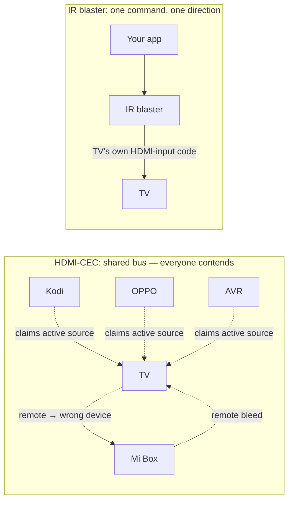

# Switching the TV's HDMI input to your source — a developer guide

Companion to the [network-playback guide](OPPO_PLAYBACK_PROTOCOL.md). Once a source (an OPPO, a Kodi
box, anything) is playing, you usually also want the **TV to switch to that source's HDMI input** — and
back. There are three ways to do it, and two of them are far more painful than they look.

> **Recommendation up front:** for an automated, reliable setup, use an **external network IR blaster**
> (e.g. a Broadlink RM4 mini). It sidesteps both the per-brand network mess *and* the HDMI-CEC tangle
> below. Reach for CEC or network control only if you can't add an IR blaster.

| Approach | How | Pros | Cons |
|---|---|---|---|
| **TV network control** | the TV's own LAN API (per brand) | precise, addressable | **proprietary per brand**, often needs a **developer/debug mode**, inconsistent, a backend per brand |
| **HDMI-CEC** | the shared CEC bus (One Touch Play / active source) | universal, no per-brand code | **ownership contention, no clean "give it back", cross-device remote bleed**, slow without QMS |
| **IR blaster** | send the TV's own input IR codes | off the CEC bus, instant, you control exactly when/what | needs line-of-sight + the TV's IR codes; one more device |

---

## 1. TV network control (per-brand) — proprietary and inconsistent

Most smart TVs expose *some* LAN control, but **every brand does it differently**, and many **don't
expose it at all until you enable a developer/debug mode**:

| Brand | Protocol | Catch |
|---|---|---|
| **LG (webOS)** | WebSocket (secure `wss://` on newer firmware) | requires turning on **Developer Mode** (install the Dev Mode app, sign in with an LG developer account, toggle it on) + a pairing prompt |
| **Sony (Bravia)** | REST / IRCC-over-IP | needs a **Pre-Shared Key** or PIN pairing enabled in the TV |
| **Samsung (Tizen)** | WebSocket (`ws://…:8001/8002`) or the SmartThings cloud | the local socket needs an on-screen **allow** prompt + a token; newer models push you to the cloud API |
| **TCL / Google TV** | **ADB** (or Google's protocols) | needs **USB/network debugging** turned on in developer options |
| **Roku** | ECP (`http://tv:8060/…`) | the easy one — but Roku-only |
| **Vizio (SmartCast)** | local HTTPS API | requires a **PIN-pairing** handshake to get a token |

The consequences:
- **You maintain a backend per brand** — different transport, different auth, different command set.
  (This project's v1 had exactly that: Sony PSK, LG, Samsung, SmartThings, ADB-keyevent, Roku ECP, and
  a "custom" fallback — that's the real maintenance cost.)
- **Many don't offer a discrete "switch to HDMI 3."** You often only get an "Input/Source" toggle or a
  picker, so you end up sending blind navigation, which is fragile.
- **Debug/developer modes can reset** (after updates, factory resets, or time-outs), silently breaking
  your integration.

Net: precise when it works, but **proprietary, gated, and inconsistent** across a mixed-brand world.

---

## 2. HDMI-CEC — universal, but a tangle

CEC is the appealing option because **everything has it**: the Kodi box, the OPPO, AVRs, and the TV all
speak CEC (branded *Bravia Sync* / *Anynet+* / *SimpLink* / *T-Link* / *VIERA Link* …). One bus, no
per-brand code. In practice it's a mess for automated control:

### a) Ownership contention — and there is no "give it back"
CEC's **One Touch Play**: a device declares itself the **active source** when it starts playing, and the
TV switches to it. The problem is there is **no clean "return ownership" primitive** — **every device
wants to *be* the one you see and imposes itself.** When your source stops, *something* has to actively
re-claim the TV (e.g. Kodi's `CECActivateSource`), and devices end up **fighting** over who's active.

### b) A stateful control chain
Driving switching through CEC means **monitoring play / stop / start events** across devices and
**asserting or reclaiming active source at exactly the right moments** — a fragile little state machine
that has to track "who should own the screen now," with no authoritative arbiter.

### c) Cross-device remote bleed (this bites hard)
CEC remote pass-through and active-source frames can land on the **wrong devices**. In our own testing,
CEC ended up effectively **controlling *every* device on the TV at once** — the Kodi box, the OPPO, the
TV, *and* an unrelated streaming box (a Mi Box) on another input were all being driven. Injecting an
`<Active Source>` frame with a **spoofed logical address** corrupted address allocation and remote
routing for the **whole bus**, not just the two devices we cared about. (See the playback project's CEC
notes.) The only *safe* CEC switch we found is a device announcing **its own** source (e.g. the OPPO on
power-on); spoofing it from elsewhere breaks the bus.

### d) Speed: it's slow without QMS (yet another requirement)
A CEC input switch is often **slow** because the whole HDMI chain has to **re-sync** — the multi-second
black-screen "bonk" — especially when the new source's **frame rate** differs (e.g. a 60 Hz UI → a
24 Hz movie). **Quick Media Switching (QMS)** (HDMI 2.1) removes that blackout by adjusting the
display's rate on the fly — *but* it needs **QMS support end-to-end** (source **and** any AVR **and** the
TV) and only works when resolution/HDR match. Most real chains don't have full QMS, so the switch stays
slow. So "make CEC switching fast" becomes "re-buy your whole chain for QMS."

### e) Inconsistent implementations
Each brand's CEC stack behaves a little differently (and many users disable it because of exactly the
bleed/contention issues above), so you can't rely on uniform behaviour.

**Bottom line:** CEC looks like the universal answer and turns into a stateful, contended, leaky
control plane with no clean hand-back and poor speed unless your entire chain is QMS-capable.

---

## 3. IR blaster — the pragmatic winner

A **network-controlled IR blaster** (e.g. a **Broadlink RM4 mini**) just sends the **TV's own IR codes**
for input selection — exactly what its remote does.

**Why it wins:**
- **Completely off the CEC bus** — no ownership fight, no cross-device bleed, nothing to corrupt.
- **You control exactly when and what** — send "HDMI 1" on play, "HDMI 4" on stop. Deterministic.
- **Brand-agnostic at the protocol level** — you don't write a per-brand backend; you just need the
  TV's IR codes (the blaster speaks IR to any TV).
- **Instant**, and decoupled from the source's power/CEC behaviour.

**Trade-offs:**
- Needs **line-of-sight** (or a stick-on emitter) to the TV's IR receiver.
- You need the TV's **input IR codes** — ideally **discrete** codes (`HDMI 1`, `HDMI 2`, … — many TVs
  have them even if the remote button doesn't), learned via the blaster or from an IR-code database;
  otherwise an `Input → arrow → OK` **macro**, which is a touch more fragile.
- One more small device on the network.

For a single known TV it removes essentially all the complexity above. That's why it's the
recommendation.

---

## Our hard-won learnings (the Kodi / OPPO / TCL chain)

Concrete results from building this on a Ugoos (CoreELEC/Kodi) + M9205 (OPPO clone) + TCL Q9L Pro:

- **The OPPO asserts CEC active source only on power-ON** (not when it starts playing while already on),
  so we **power-cycled it** to switch the TV — works, but ~24 s (mostly its boot time).
- **Two attempts to inject the switch from the Kodi box both broke the bus:** `cec-client` (opened a
  second libCEC client and corrupted Kodi's own CEC), and writing the frame to the Amlogic
  `/sys/class/aocec/cmd` driver (the spoofed active-source frame **cross-controlled the Mi Box** on
  another input). Reverted both.
- **No clean reclaim:** Kodi's `CECActivateSource` is best-effort; the input would still get re-grabbed.
- **Recovery from a confused CEC bus:** put the asserting device in standby + restart Kodi; if a sibling
  device is *still* cross-controlled, **cold-start everything with the TV unplugged from mains for
  ~30–60 s** (CEC state survives standby — only a real power-off flushes the TV's routing table).
- **Direction:** move to an **external IR blaster (Broadlink RM4 mini)** for a CEC-free switch — exactly
  the recommendation above.

---

## References

- **HDMI QMS (Quick Media Switching):**
  [hdmi.org](https://www.hdmi.org/spec2sub/quickmediaswitching) ·
  [What Hi-Fi? explainer](https://www.whathifi.com/advice/what-is-quick-media-switching-qms-the-latest-hdmi-21-feature-explained) ·
  [FlatpanelsHD guide + support list](https://www.flatpanelshd.com/guide.php?subaction=showfull&id=1679669681)
- **Per-brand TV network control:**
  [LG webOS developer docs](https://webostv.developer.lge.com/develop/references/webostvjs-webos) (Developer Mode + WebSocket) ·
  [awesome-smart-tv](https://github.com/vitalets/awesome-smart-tv) (per-brand control protocols)
- **HDMI-CEC:** the CEC One Touch Play / active-source behaviour is part of the HDMI CEC spec; brand
  names are *Bravia Sync / Anynet+ / SimpLink / T-Link / VIERA Link*.
- **This project's CEC saga:** OppoKodiBridge `DEV_NOTES` / memory (the cec-client + aocec failures and
  the Mi Box cross-control).
