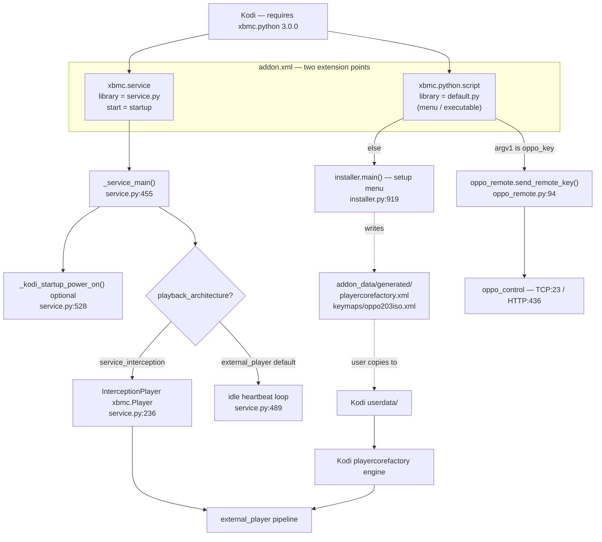
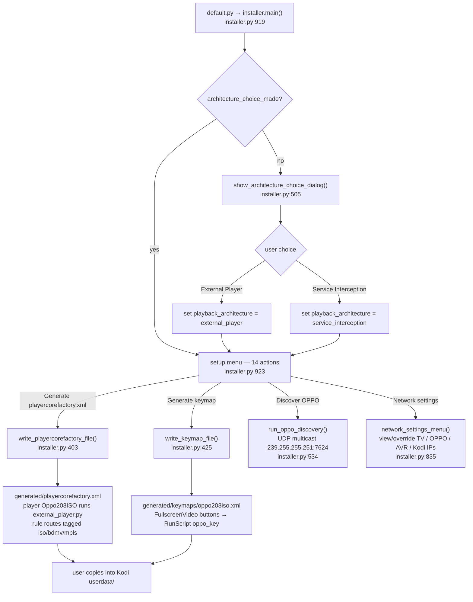
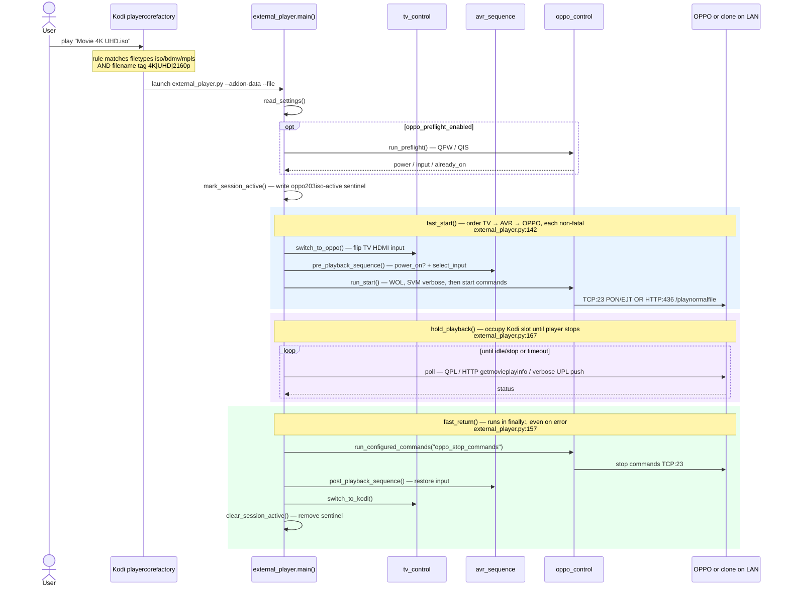
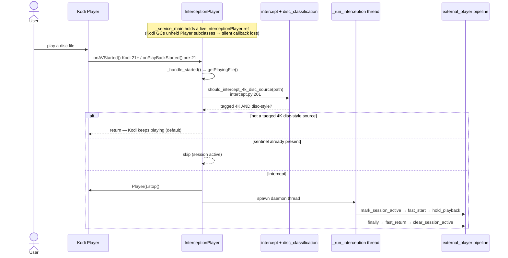
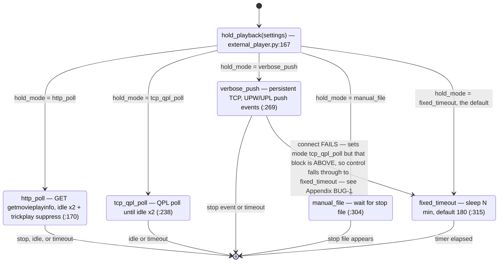
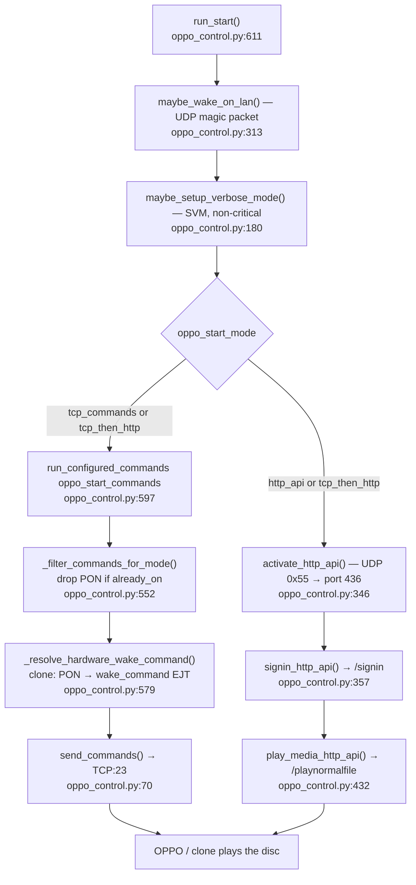
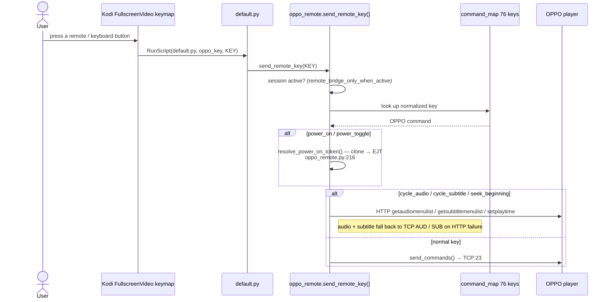
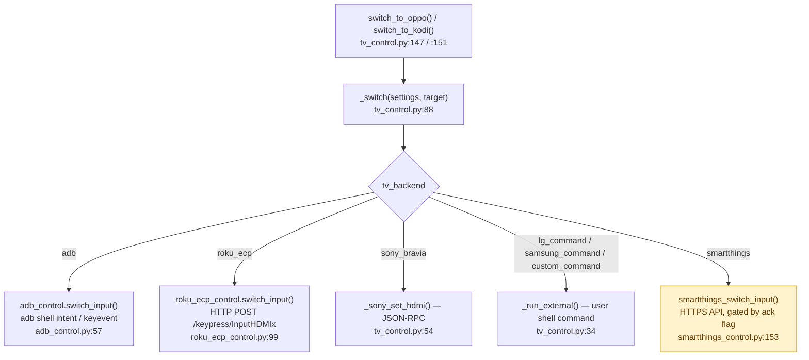
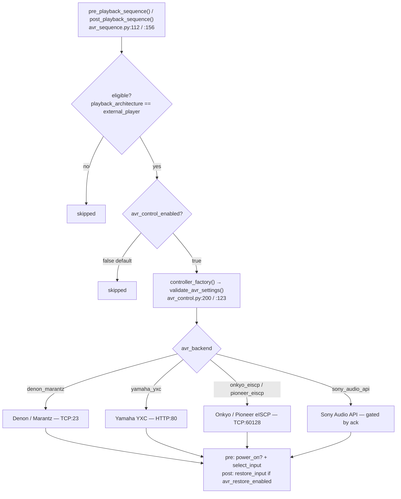

# Add-on functional flow — how `script.oppo203.iso.external` actually works

**Scope:** the Kodi add-on (Python under `resources/lib/`, entry points `default.py` /
`service.py`). The Windows configurator is out of scope here.

**Signature:** code-verified against the current source at `main`@`900834b` (read, not run;
**no hardware validation**). Every box names a real function with a `file:line` anchor you
can click. Diagrams are [Mermaid](https://mermaid.js.org) — they render natively on GitHub
and in most Markdown previewers.

**The one thing to understand first:** this add-on does **not** stream video and never calls
Kodi's `setResolvedUrl`. "Playback" means **handing a physical OPPO Blu-ray player a disc to
play over the LAN** while Kodi just holds the playback slot open. Two architectures
(`playback_architecture` setting) both converge on the same pipeline in
[`external_player.py`](../resources/lib/kodi/external_player.py).

Jargon, once:
- **playercorefactory.xml** — a Kodi config file that tells Kodi "for files matching this
  rule, launch this external program instead of playing it yourself."
- **external player** — any non-Kodi program Kodi launches to handle a file; here it's our
  `external_player.py` wrapper.
- **keymap** — a Kodi config file binding remote/keyboard buttons to actions; ours forwards
  buttons to the OPPO.
- **sentinel** — a marker file (`oppo203iso-active`) whose mere existence means "a handoff
  session is in progress."
- **WOL / `#PON` / `#EJT` / `#QPL` / `#SVM`** — Wake-on-LAN, and OPPO IP-control commands
  (power on / eject-to-wake for clones / query-playback-status / set-verbose-mode).

---

## A. Architecture & entry points

`addon.xml` declares **two** Kodi extension points — a script (the menu + the remote-key
bridge) and a background service.

**Anchors:** `addon.xml:6` (script), `addon.xml:9` (service, `start="startup"`),
`default.py:10-13` (argv dispatch).

---

## B. One-time setup (the installer menu)

The user opens the add-on once to choose an architecture and generate the two config files,
then copies them into Kodi's `userdata/`.

The generated `<player>` element (`installer.py:97`) is literally
`{python} "external_player.py" --addon-data "<dir>" --file "{1}"`, and the routing rule
(`installer.py:135`) is
`<rule filetypes="iso/bdmv/mpls" filename="<4K|UHD|2160p…>" player="Oppo203ISO"/>` with
`action="prepend"`. **XML mode is filename/path driven** — it cannot look inside an ISO, so
every rule requires an explicit `4K`/`UHD`/`2160p` tag in the name.

---

## C. Play-time — External Player mode (the spine)

This is the load-bearing path. Kodi's own playercorefactory engine matches the rule and
launches our wrapper as a subprocess; the wrapper orchestrates TV → AVR → OPPO, holds the
slot, then restores everything.

**Why the order matters:** `fast_start` switches the TV **before** waking the OPPO so the
input is ready when video appears; AVR sits between them. Each stage is **non-fatal by
design** (`_safe_tv_switch` at `external_player.py:121`, AVR warnings at `:152`/`:161`) — a
TV or AVR failure must never block OPPO startup or, more importantly, the `fast_return`
cleanup, which is why `fast_return` + `clear_session_active` live in a `finally:`
(`external_player.py:360-366`).

---

## D. Play-time — Service Interception mode

Same pipeline, different trigger. Instead of Kodi routing the file out via
playercorefactory, the service watches Kodi's own player, stops it, and threads into the
identical `fast_start → hold_playback → fast_return`.

The intercept decision is `tag AND disc-style`: `has_uhd_disc_tag()`
(`disc_classification.py:51`, substring `4k`/`uhd`/`2160p`) **and** `is_4k_disc_style_source()`
(`disc_classification.py:80`, ISO or BDMV navigation/playlist — loose `.mkv`/`.mp4`/`.m2ts`
stay in Kodi).

---

## E. `hold_playback` — the 5-mode state machine

Once the OPPO is playing, the wrapper must keep the Kodi slot occupied until the disc stops.
`hold_mode` selects one of five stop-detection strategies (`external_player.py:167`).

The four active modes detect stop differently: HTTP poll reads `e_play_status` from
`/getmovieplayinfo` with a trick-play suppression window so fast-forward isn't mistaken for
stop; TCP QPL polls `#QPL`; verbose-push opens a persistent socket and listens for `@UPW 0`
/ `@UPL <stop>` push events; manual-file just waits for a sentinel file; fixed-timeout is a
blind sleep.

---

## F. OPPO control — start transports

`run_start` wakes the player, sets verbose mode, then sends the disc-start commands over one
of two transports chosen by `oppo_start_mode`.

**Clone handling:** stock OPPO uses `#PON`; Chinoppo-style clones can't power on the same
way, so the wake command is rewritten to `#EJT` (eject-to-wake). Note this rewrite logic
exists in **three** places with different mechanisms — see Appendix.

---

## G. Remote-key bridge (control during playback)

While the disc plays, the TV shows the OPPO's HDMI input — but the remote events still reach
the Kodi box. The keymap forwards each button back through Kodi into our script, which
translates it to an OPPO command.

The keymap is **static** — `_keymap_document_xml()` (`installer.py:204`) hard-codes every
`<FullscreenVideo>` binding; it is not regenerated from the 76-key command map.

---

## H. TV input switching

`switch_to_oppo()` / `switch_to_kodi()` dispatch to one of seven backends by `tv_backend`.

All seven backends are implemented. SmartThings (yellow) is **not** a no-op — it makes live
HTTPS calls but only after the user sets `smartthings_experimental_acknowledged`
(`smartthings_control.py:170`). TV switching is settings-gated and entirely optional
(`tv_switching_enabled`, `external_player.py:107`).

---

## I. AVR (receiver) sequencing

Optional audio-receiver power/input control, wrapped around the OPPO handoff. **Disabled by
default.**

---

## Appendix — noticed while mapping (NOT fixed; flow doc is read-only)

These are correctness observations surfaced while tracing the real code. They are recorded
here for the operator, consistent with the §3c suspect-discipline; **no fix is made in this
doc**.

- **BUG-1 — `verbose_push` hold silently degrades to a 180-min blind timeout.** On TCP
  connect failure, `external_player.py:300-302` sets `mode = "tcp_qpl_poll"` intending to
  fall back to QPL polling, but the `tcp_qpl_poll` block is physically **above** (`:238`),
  so control falls through to the unconditional `fixed_timeout` default (`:315`). The
  comment at `:301` ("Fall through to tcp_qpl_poll logic below") is wrong about direction.
  Effect: a flaky verbose-push connection holds the Kodi slot for `fixed_timeout_minutes`
  (default 180) instead of polling for the real stop.
- **BUG-2 — diagnostics HTTP probe checks the wrong port.** `default.py:53-63` (`_http`
  helper in `run_diagnostics_dashboard`) connects to **port 80**, but the OPPO HTTP API is
  **port 436** (`oppo_control` HTTP path). The diagnostic reports HTTP reachability against
  a port the device doesn't serve.
- **Dead-at-runtime — `intercept.should_intercept()` whitelist/blacklist engine**
  (`intercept.py:243`) is tested but has no production caller; service interception uses
  `should_intercept_4k_disc_source` (`intercept.py:201`) instead.
- **Triplicated clone-wake logic.** The `#PON → #EJT` clone rewrite exists in three places
  with three different mechanisms: `oppo_control._resolve_hardware_wake_command` (`:579`,
  profile `is_clone`), `oppo_remote.resolve_power_on_token` (`:216`, profile `is_clone`),
  and `service._startup_wake_token` (`:603`, substring model markers). The three can drift.
- **AVR powers on but never off.** `pre_playback_sequence` can `power_on`, but no path ever
  powers the receiver off, and `avr_power_off_enabled` / `avr_volume_automation_enabled` are
  declared in settings yet have **no consumer** in any execution path.
